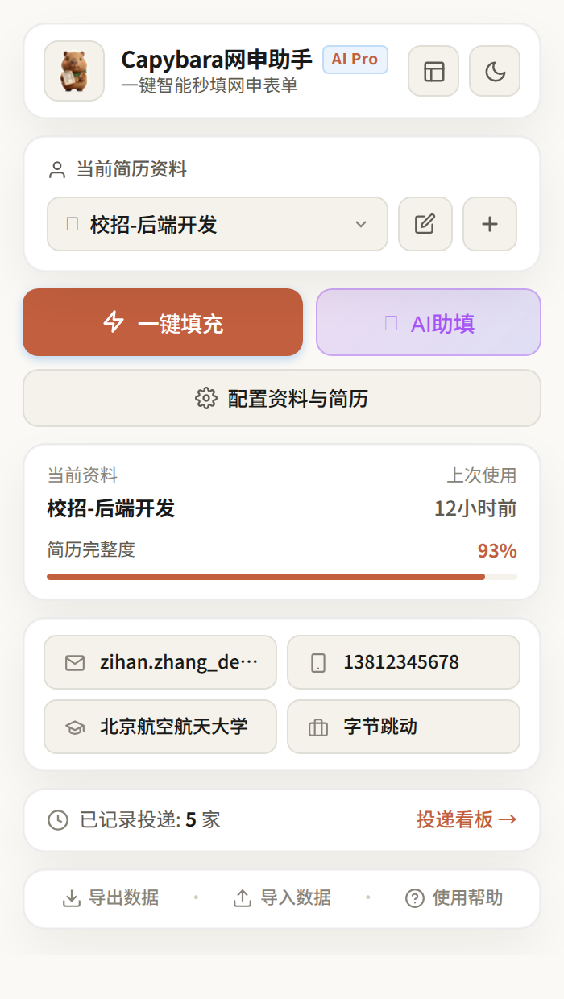
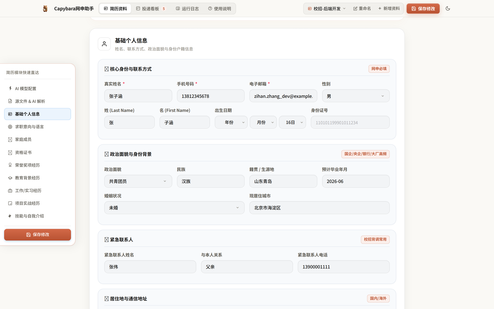
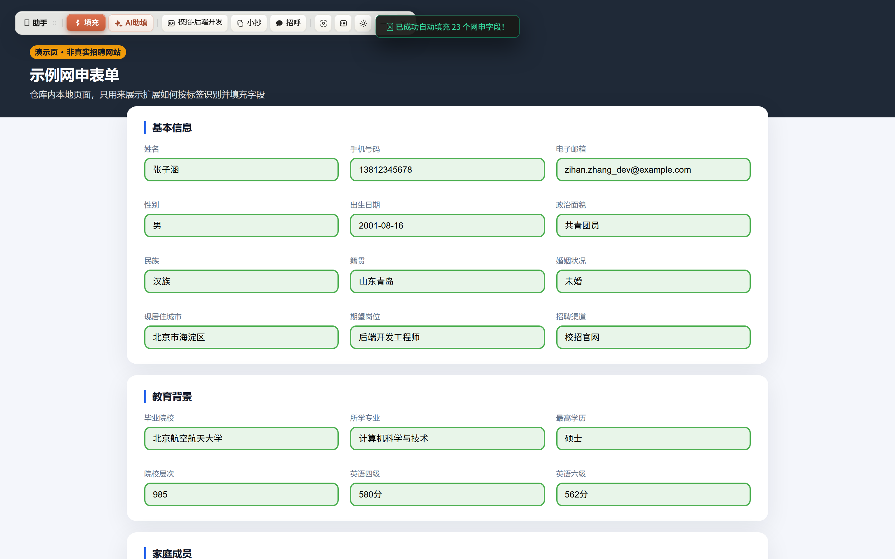
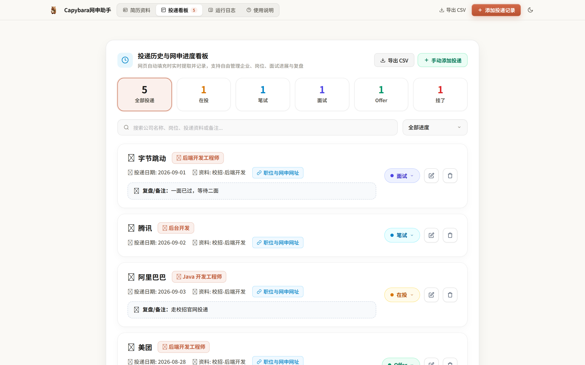

# Capybara 网申助手

Chrome 扩展：识别并自动填充校招 / 社招网申表单。资料存在本地，支持多套简历、投递看板，以及可选的 AI 简历解析。

纯原生 JS，没有构建步骤，也没有 npm 依赖。

<p align="center">
  
</p>

## 界面

配置页录入基础信息、家庭成员、证书等秋招常见字段：



弹窗、配置页、看板都是扩展自己的界面。下面这张填充效果拍的是仓库里的**示例表单**（`test/fixtures/demo-apply-form.html`），不是某家公司的真实招聘站：



填充时会记下公司 / 岗位，投递看板里改进度、导出 CSV：



## 能做什么

- 一键填充姓名、联系方式、教育 / 实习 / 项目等常见字段（中英文标签）
- 多套资料切换，例如校招后端、实习前端各一份
- 投递看板：在投、笔试、面试、Offer、挂了
- 可选 AI：上传 PDF / Word / 图片解析进表单，并生成 HR 打招呼语
- 数据在 `chrome.storage.local`，可导出 JSON 备份

秋招补充字段：婚姻状况、现居住城市、招聘渠道、出差意愿、家庭成员、院校层次、结构化证书。

## 安装

1. 打开 `chrome://extensions/`
2. 打开右上角「开发者模式」
3. 点「加载已解压的扩展程序」
4. 选仓库里的 `job-autofill-assistant/` 目录（含 `manifest.json` 的那一层）

改完代码后在扩展页点刷新。Windows 若加载的是桌面副本，需要先把内层目录同步过去再刷新。

## 使用

1. 点扩展图标 →「配置资料与简历」，填资料或用 AI 解析简历
2. 打开企业校招 / 北森 / 莫招等网申页
3. 点弹窗「一键填充」，或用页面右下角悬浮窗
4. 填完务必自己核对一遍再提交

AI 不是必开。要用的话在配置页填 API Key，支持 DeepSeek、通义、智谱、Kimi、Gemini 等。

## 隐私

简历和投递记录只存在本机浏览器。启用 AI 后，解析用的文本会发到你配置的模型接口。

## 开发

```bash
# 仓库根目录
node test/run.mjs
```

扩展本体在 `job-autofill-assistant/`。popup / options / content 都不直接读写存储，一律发消息给 `background.js`。

重新截 README 图（需本机 Chrome 与 `~/.venvs/pw`）：

```bash
~/.venvs/pw/bin/python test/screenshot.py
```

## 许可

个人求职自用。填充结果不保证与目标网站完全一致，提交前请人工检查。
